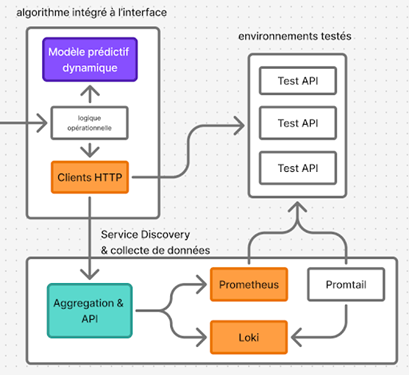

# Prerequisites

- Docker
- Minikube
- kubectl
- Python 3.12 (for local development)

# How to run 
start kube env
```
minikube start
```

build image :
```
docker build -t cluster_api ./kubernetes/service_registry/custom_aggregation_api/
```

load image into minikube
```
minikube image load cluster_api && minikube image load sample_api
```

Deploy cluster
```
kubectl apply -f ./kubernetes/target_apis/ && kubectl apply -f ./kubernetes/service_registry/ && kubectl get pods
```

Delete commands 
```
kubectl delete all --all
```

forwarding ports to test cluster on the host
```
kubectl port-forward Deployment/prometheus-server 8080:8080
```

envoyer des appels à l'api de test :
```
curl --request POST   --url http://localhost:8000/ml   --header 'content-type: application/json'   --data '{"input":15}'
```


# Architecture 
